# SmartSlack

A macOS menu bar app that monitors Slack channels, threads, and DMs on configurable schedules. It uses [Claude Code](https://claude.ai/claude-code) CLI to analyze new messages and draft replies, letting you review, rewrite, or send them directly from the app.

## Features

- **Schedule-based monitoring** - Set up recurring checks on any Slack channel, thread, DM, or group DM with intervals from 5 seconds to 24 hours
- **AI-powered analysis** - Claude reads new messages and generates a summary + draft reply based on your custom prompt
- **Smart filtering** - Add filter criteria to your prompt (e.g., "only care about native development") and Claude auto-skips irrelevant conversations, with configurable notification for skipped sessions
- **Draft workflow** - Review drafts, rewrite with feedback, browse draft history, or ignore
- **Owner awareness** - Recognizes your own messages, skips Claude when only you posted, and drafts in your voice
- **Image support** - Downloads and previews image attachments from Slack messages
- **Two ways to create schedules** - Browse channels or paste a Slack message link to auto-detect the conversation type
- **Persistent color coding** - Each person in conversations gets a unique color, click to customize
- **Menu bar app** - Runs in the background with live badge counts for active and failed schedules
- **Notifications** - Three modes per schedule: macOS notification, force popup (always-on-top, undismissable), or quiet
- **Prompt management** - Save, star, search, and reuse prompts with Claude-powered auto-tagging
- **Keyboard navigation** - Vim-style keys for navigating schedules, cycling tabs, and managing prompts (press `?` for cheatsheet)
- **Full history** - Searchable, paginated history of all sessions with summaries, drafts, and actions taken
- **Logging** - Detailed logs of every fetch, Claude call, and action for debugging

## Screenshots

### Main View
The main interface with sidebar schedule list, color-coded conversation view, AI-generated summary, and draft reply.

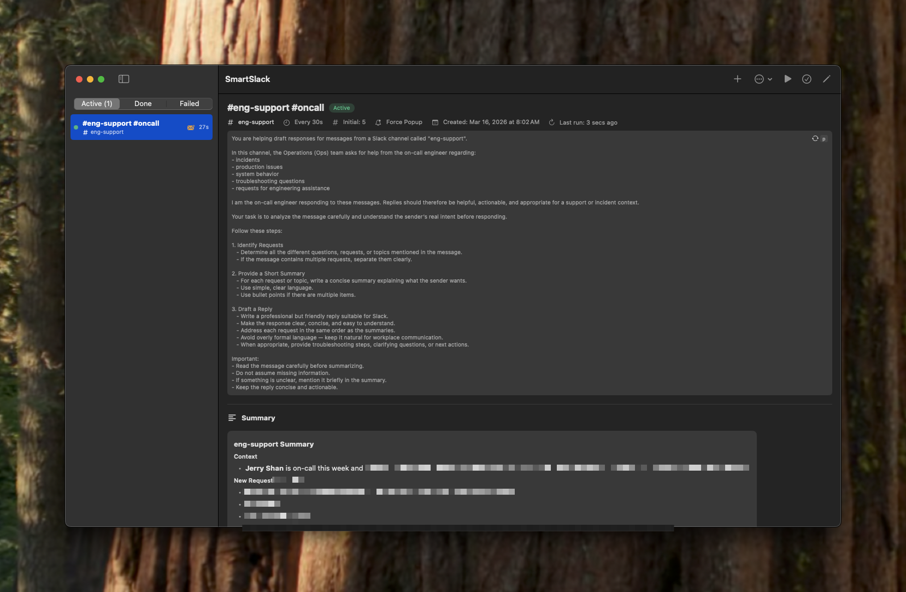

### Draft Workflow
Review Claude's draft, then Edit & Send (`e`), Rewrite (`r`), Active Reply (`a`), or Ignore (`i`) — all with keyboard shortcuts.

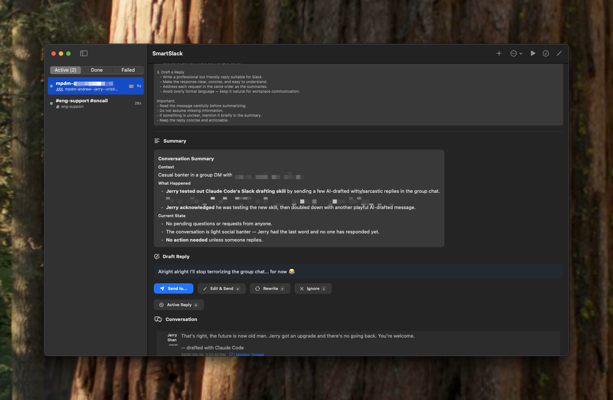

### Smart Filtering (Skip)
Claude auto-detects filter criteria in your prompt and skips irrelevant conversations. Skipped sessions show the reason and a "Generate Draft" button to override.

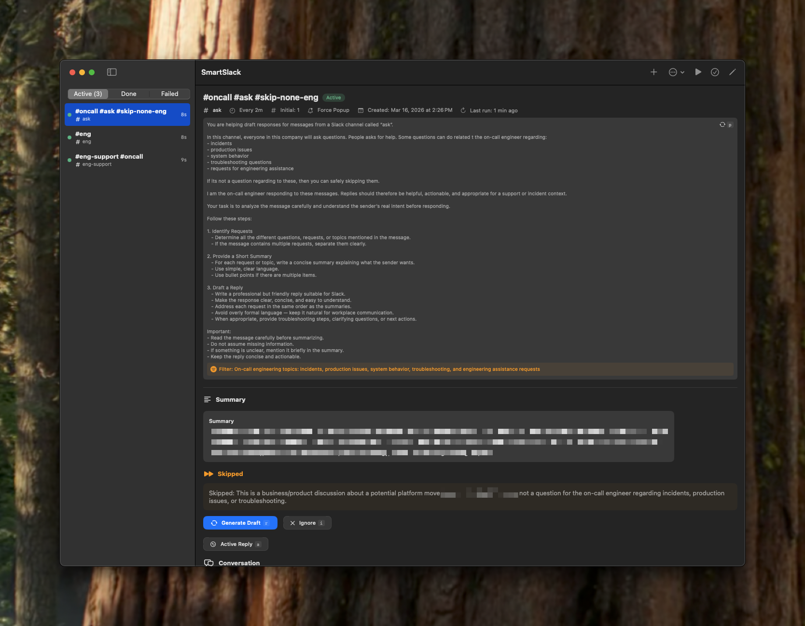

### Send Target Picker
Choose to send to the channel or reply in a specific message's thread.

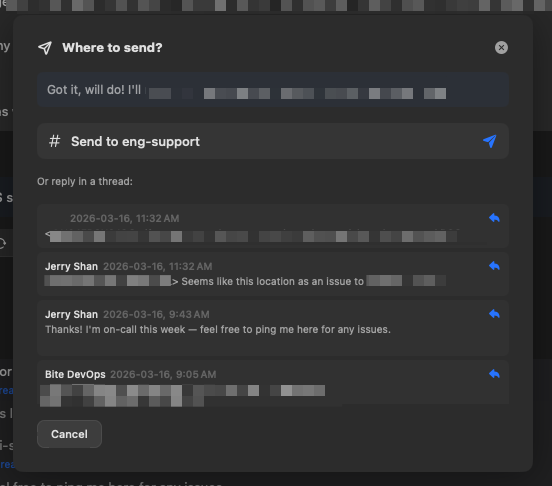

### Rewrite Overlay
Give Claude feedback to regenerate the draft with full conversation context.

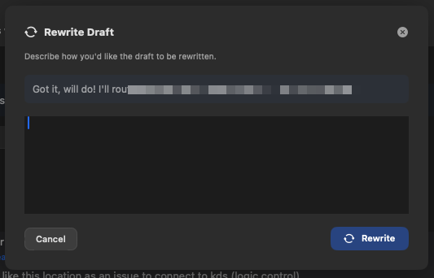

### Create Schedule from Link
Paste a Slack message URL to auto-detect channel, thread, and conversation type.

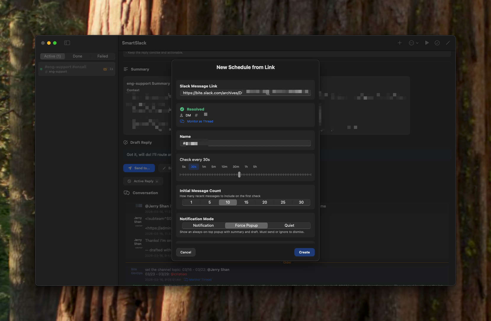

### Prompt Manager
Save, star, search, and reuse prompts with Claude-powered auto-tagging.

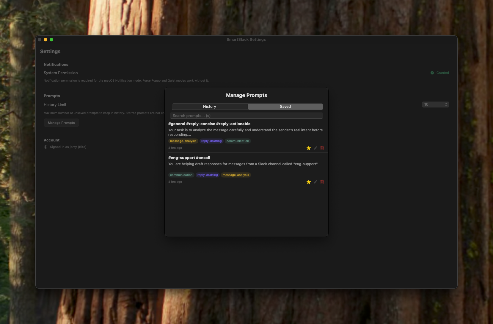

### Force Popup Notification
Always-on-top, undismissable panel for urgent schedule notifications.

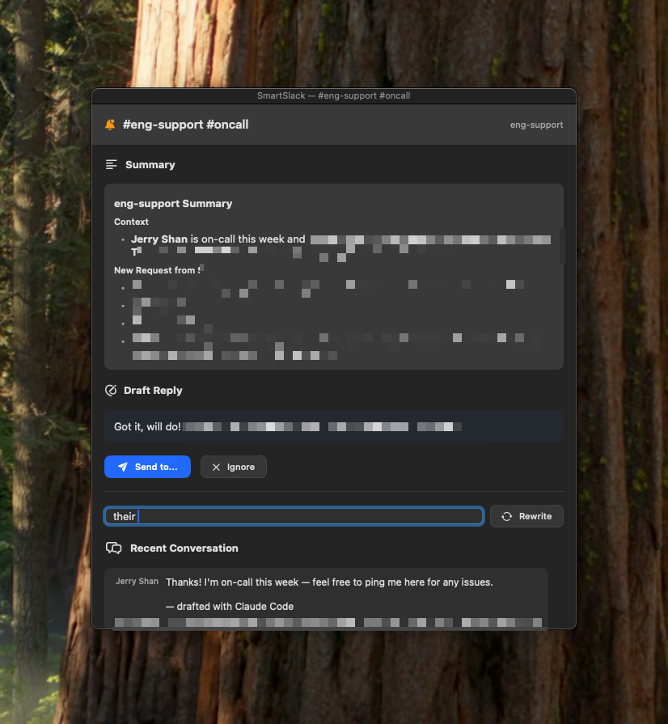

### Image Preview
Click conversation images for a full-size preview with `h`/`l` keyboard navigation.

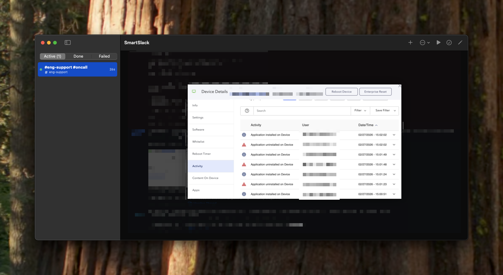

### Session History
Browse past sessions with summaries, drafts, and actions taken.

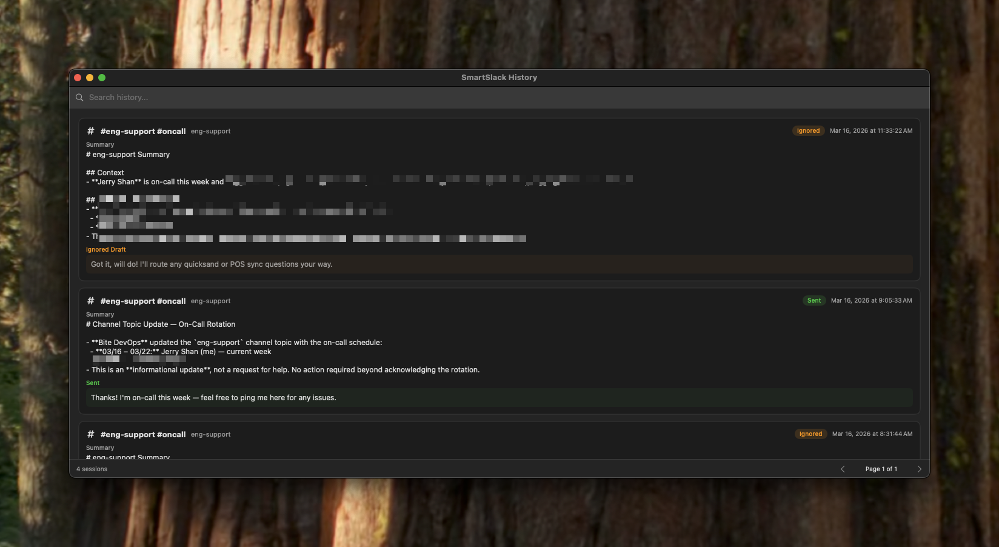

### Keyboard Cheatsheet
Press `?` anywhere to see all available shortcuts.

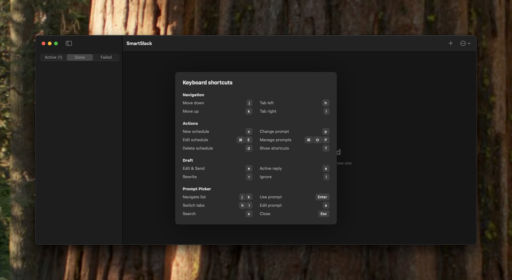

### Menu Bar
Compact menu bar icon with live badge counts — green (active), orange (pending), red (failed).

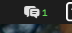

### Login
Paste your Slack User OAuth Token to get started.

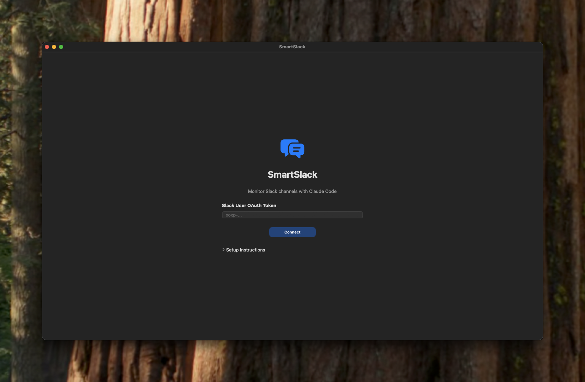

## Requirements

- macOS 14.0+
- [Claude Code CLI](https://claude.ai/claude-code) installed at `/opt/homebrew/bin/claude`
- [XcodeGen](https://github.com/yonaskolb/XcodeGen) (for building from source)
- A Slack User OAuth Token (`xoxp-...`)

## Setup

### 1. Clone and build

```bash
git clone https://github.com/nuynait/smart-slack.git
cd smart-slack
xcodegen generate
open SmartSlack.xcodeproj
```

Build and run from Xcode (Cmd+R).

### 2. Create a Slack App

1. Go to [api.slack.com/apps](https://api.slack.com/apps) and create a new app
2. Under **OAuth & Permissions**, add these **User Token Scopes**:
   - `channels:history`, `channels:read`
   - `groups:history`, `groups:read`
   - `im:history`, `im:read`
   - `mpim:history`, `mpim:read`
   - `chat:write`
   - `users:read`
   - `search:read`
   - `files:read`
3. Install the app to your workspace
4. Copy the **User OAuth Token** (starts with `xoxp-`)

### 3. Connect

Launch SmartSlack, paste your token, and click **Connect**. The app validates against `auth.test` and stores the token securely in your macOS Keychain.

## Usage

### Creating a Schedule

Click `+` and paste a Slack message URL. The app auto-detects the channel, type, and thread. Just add a name, check interval, and prompt.

### Prompt Tips

The prompt tells Claude how to analyze messages and what kind of reply to draft. Examples:

- *"Summarize any support requests and draft a helpful response"*
- *"Watch for questions directed at me and draft concise answers"*
- *"Monitor for deployment issues and draft an acknowledgment"*

### Working with Drafts

When new messages arrive, Claude generates a summary and draft reply:

- **Send** - Posts the draft to Slack (appends "drafted with Claude Code")
- **Rewrite** - Give Claude feedback and get a new draft
- **Ignore** - Skip this session, wait for the next check

### Keyboard Shortcuts

Press `?` anywhere (outside a text field) to see the full cheatsheet.

| Key | Action |
|-----|--------|
| `j` / `k` | Move down / up in schedule list |
| `h` / `l` | Cycle tabs left / right (wraps around) |
| `p` | Open prompt picker |
| `?` | Toggle keyboard cheatsheet |
| `Esc` | Dismiss overlay |

In the prompt picker, the same `j`/`k`/`h`/`l` keys navigate prompts and tabs. Press `Enter` to select, `e` to edit, or `Esc` to close.

### Schedule Lifecycle

- **Active** - Timer running, checking for new messages
- **Completed** - Manually marked done, timer stopped
- **Failed** - Error occurred (bad API response, Claude failure), can re-activate

## Architecture

See [doc/design.md](doc/design.md) for detailed system design and implementation guide.

```
SmartSlack/
├── SmartSlackApp.swift          # App entry point
├── AppDelegate.swift            # Menu bar status item
├── Models/
│   ├── Schedule.swift           # Schedule, Session, DraftEntry
│   └── SlackModels.swift        # Slack API response types
├── Services/
│   ├── SlackService.swift              # Slack REST API client (actor)
│   ├── ClaudeService.swift             # Claude CLI subprocess
│   ├── SchedulerEngine.swift           # Per-schedule timers + execution
│   ├── ScheduleStore.swift             # JSON file persistence
│   ├── LogService.swift                # Event logging
│   ├── KeychainService.swift           # Secure token storage
│   ├── UserColorStore.swift            # User color assignments
│   ├── NotificationService.swift       # Notifications + force popup
│   ├── PromptStore.swift               # Prompt history + saved prompts
│   └── KeyboardNavigationState.swift   # Keyboard navigation state
├── ViewModels/
│   └── AppViewModel.swift       # Root state manager
├── Views/                       # SwiftUI views
└── Utilities/
    ├── Constants.swift           # Paths, config
    └── Extensions.swift          # Colors, formatters, button styles
```

## Data Storage

All data is stored locally:

| Data | Location |
|------|----------|
| Schedules | `~/Library/Application Support/SmartSlack/schedules/*.json` |
| Logs | `~/Library/Application Support/SmartSlack/logs/*.log` |
| User colors | `~/Library/Application Support/SmartSlack/user_colors.json` |
| Prompts | `~/Library/Application Support/SmartSlack/prompts.json` |
| Starred channels | `~/Library/Application Support/SmartSlack/starred_channels.json` |
| Slack token | macOS Keychain |

## License

MIT
